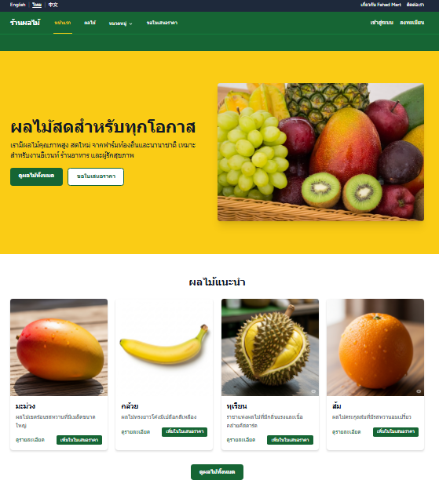

# Fruit Shop - Promotion & Quotation Web Application

<p align="center">


</p>

## About Fruit Shop

Fruit Shop is a professional web application designed for fruit vendors to showcase their products and allow customers to request quotes. The platform provides a visually appealing interface for browsing fruits, viewing detailed product information, and submitting quote requests.

## Features

### Customer Features

- **Fruit Showcase**: Browse all available fruits with filtering by category
- **Detailed Product Information**: View fruit details including origin, seasonality, and descriptions
- **Quote Request System**: Add fruits to a quote request and specify quantities
- **Contact Form**: Easily get in touch with the business

### Admin Features

- **Secure Dashboard**: Manage all aspects of the website
- **Product Management**: Add, edit, and delete fruit listings
- **Category Management**: Organize fruits into categories
- **Quote Request Management**: View and manage customer quote requests
- **User Management**: Manage admin accounts and permissions

## Technology Stack

- **Framework**: Laravel 12
- **Frontend**: Blade templates with Tailwind CSS
- **Authentication**: Laravel Breeze
- **Database**: SQLite

## Installation

1. Clone the repository
   ```bash
   git clone https://github.com/yourusername/fruit-shop.git
   ```

2. Navigate to the project directory
   ```bash
   cd fruit-shop
   ```

3. Install dependencies
   ```bash
   composer install
   npm install
   ```

4. Copy the environment file
   ```bash
   cp .env.example .env
   ```

5. Generate application key
   ```bash
   php artisan key:generate
   ```

6. Run migrations and seed the database
   ```bash
   php artisan migrate --seed
   ```

7. Compile assets
   ```bash
   npm run dev
   ```

8. Start the development server
   ```bash
   php artisan serve
   ```

## Usage

### Customer Interface

- Visit the home page to see featured fruits
- Browse all fruits or filter by category
- Click on a fruit to view detailed information
- Add fruits to your quote request
- Fill out the quote request form with your contact information
- Submit your request and receive a confirmation

### Admin Interface

- Access the admin dashboard at `/login`
- Default admin credentials:
  - Email: admin@example.com
  - Password: password
- Manage fruits, categories, and quote requests
- Update site content and settings

## Screenshots

### Homepage


*To add your own screenshot:*
1. Take a screenshot of your homepage
2. Save it in the 'screenshots' folder (already created in the project root)
3. Make sure it's named 'homepage.png' to match the reference above

## License

The Fruit Shop application is open-sourced software licensed under the [MIT license](https://opensource.org/licenses/MIT).
